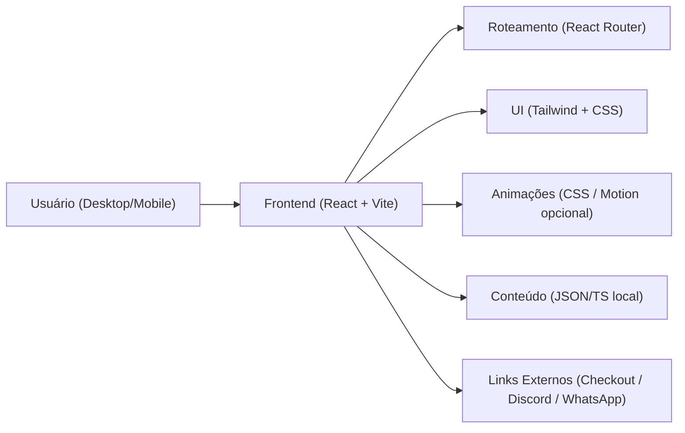
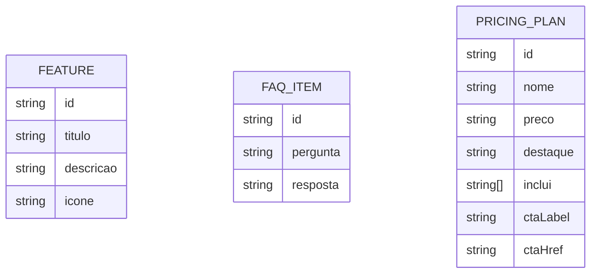

## 1. Desenho de Arquitetura

## 2. Descrição de Tecnologias
- Frontend: React@18 + TypeScript + vite
- Estilos: tailwindcss@3 + CSS custom (variáveis, efeitos, keyframes)
- Roteamento: react-router-dom
- Animações:
  - Base: CSS (keyframes, transitions, scroll-reveal via IntersectionObserver)
  - Opcional: framer-motion (se necessário para orquestrações mais complexas)
- Qualidade: eslint + prettier (se presentes no template), assets otimizados
- Backend: Nenhum (landing page estática)
- Dados: conteúdo em arquivo local (ex.: arrays TS/JSON para features/FAQ/pricing)
- Deploy: Vercel (build estático do Vite)

## 3. Definição de Rotas
| Rota | Finalidade |
|------|------------|
| / | Landing page (seções + CTA + navegação por âncora) |
| /termos | Termos de uso |
| /privacidade | Política de privacidade |

## 4. Definições de API (se houver backend)
Não aplicável (sem backend).

## 5. Diagrama de Arquitetura de Servidor (se houver backend)
Não aplicável (sem backend).

## 6. Modelo de Dados (se aplicável)
### 6.1 Definição do Modelo de Conteúdo (Local)
O site usa “modelos” locais apenas para renderizar seções.

### 6.2 Data Definition Language (DDL)
Não aplicável (sem banco de dados).
