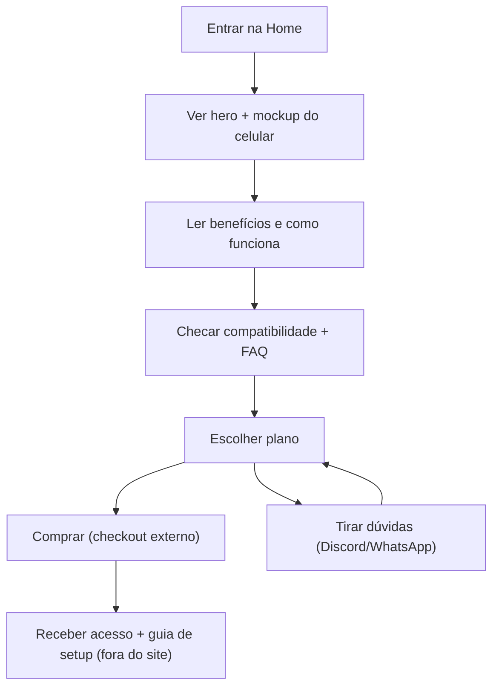

## 1. Visão Geral do Produto
Landing page premium para vender um método de “remote control” que permite usar menu no FiveM pelo celular, com foco em confiança, clareza e conversão.
- Resolve: explicar rapidamente o que é, como funciona e por que é seguro/estável, reduzindo dúvidas e acelerando a compra
- Público: jogadores de FiveM interessados em praticidade e controle pelo celular; comunidades e revendedores
- Valor: aumentar conversão com apresentação profissional, demo clara e CTA direto para compra/suporte

## 2. Funcionalidades Centrais

### 2.1 Papéis de Usuário (se aplicável)
| Papel | Método de Acesso | Permissões Principais |
|------|-------------------|------------------------|
| Visitante | Livre | Navegar, ver demo, ler FAQ, acessar termos/privacidade |
| Cliente (fora do site) | Após compra | Receber acesso, seguir instruções de setup, usar o remote control |

### 2.2 Módulos de Funcionalidade
1. **Home (Landing)**: hero com impacto, prova visual (mockup), benefícios, “como funciona”, compatibilidade, pricing, FAQ, CTA
2. **Termos**: termos de uso e limitações de suporte/garantia
3. **Privacidade**: política de privacidade e coleta de dados (mínima)

### 2.3 Detalhes por Página
| Nome da Página | Nome do Módulo | Descrição da Funcionalidade |
|---|---|---|
| Home | Header + navegação | Navegação por âncoras (seções), CTA fixo, versão mobile com menu compacto |
| Home | Hero (impacto) | Headline curta, subtítulo, chips de benefícios, CTAs primários/ secundários |
| Home | Demonstração (mockup) | Ilustração/“phone UI” animada mostrando o controle via celular |
| Home | Benefícios | Grid de benefícios com microanimações e ícones customizados |
| Home | Como funciona | Passos numerados com animação em sequência (reveal) e linhas conectando |
| Home | Compatibilidade | Lista clara (FiveM, Windows, Android/iOS, requisitos), com badges |
| Home | Planos/Preço | Cards de planos, “o que inclui”, destaque do plano recomendado, CTA por plano |
| Home | Prova social | Depoimentos (curtos), contadores (ex.: “comunidades atendidas”), selos de confiança |
| Home | FAQ | Accordion com dúvidas comuns (setup, segurança, ban risk, suporte, updates) |
| Home | Contato/Suporte | Botões: Discord/WhatsApp/Email (links externos), horários e SLA (texto) |
| Home | Rodapé | Links legais, status/versão do produto (texto), copyright |
| Termos | Conteúdo legal | Texto estruturado (títulos, listas), data de atualização, contato |
| Privacidade | Conteúdo legal | Texto estruturado, o que é coletado (ex.: analytics), contato |

## 3. Processo Central
Fluxo principal:
1. Usuário entra na Home e entende a proposta em 5–10 segundos (headline + mockup).
2. Usuário valida confiança (como funciona + compatibilidade + prova social).
3. Usuário escolhe um plano e clica em “Comprar agora” (checkout externo) ou “Falar no suporte” (Discord/WhatsApp).
4. Após compra, usuário recebe acesso/instruções e configura o remote control no PC e no celular.

## 4. Design de Interface
### 4.1 Estilo Visual
- Direção: “Noir Neon / Tactical UI” (escuro elegante, acentos neon controlados, sensação premium-tech)
- Cores:
  - Fundo: preto grafite / carvão (com textura/grain sutil)
  - Texto: off-white
  - Acento 1: ciano/neon (CTAs, highlights)
  - Acento 2: âmbar/vermelho controlado (avisos, detalhes)
- Botões: cantos levemente arredondados, borda luminosa suave, hover com “glow” e micro deslocamento
- Tipografia:
  - Display: uma fonte “tech” de personalidade (ex.: Chakra Petch ou similar)
  - Texto: uma sans legível e refinada (ex.: IBM Plex Sans ou similar)
- Layout: desktop-first, seções grandes, grids assimétricos, camadas (overlaps), elementos decorativos (linhas, badges, ruído)
- Ícones: linear/monocromático com pequenos acentos, evitando packs genéricos

### 4.2 Visão Geral (UI por Página)
| Nome da Página | Nome do Módulo | Elementos de UI |
|---|---|---|
| Home | Hero | Headline grande, CTA forte, background com efeitos (mesh + grain), badges, animação de entrada |
| Home | Mockup | “Celular” em destaque com UI fake animada, parallax leve e brilho controlado |
| Home | Benefícios | Cards com bordas, hover, ícones custom, transições suaves |
| Home | Como funciona | Steps numerados, connectors, reveal em scroll, microanimações |
| Home | Preço | Pricing cards com ênfase no recomendado, comparativo simples, CTA por plano |
| Home | FAQ | Accordion com animação suave, destaque em keywords |
| Termos | Conteúdo | Tipografia editorial, hierarquia clara, links no topo |
| Privacidade | Conteúdo | Tipografia editorial, listas claras, linguagem objetiva |

### 4.3 Responsividade
- Desktop-first com adaptação mobile: navegação compacta, seções empilhadas, CTAs grandes
- Touch: botões com área mínima confortável, accordions fáceis de tocar, evitar hover-dependência
- Performance: animações leves, imagens otimizadas, fallback de efeitos em dispositivos fracos
